# Apache Airflow Demo

# Introduction & Goals
- The goal of the project was to create a pipeline using Airflow using python, bash, and hive operators

# The Data Set
- Data type: 
  - CSV
  - 3219 rows

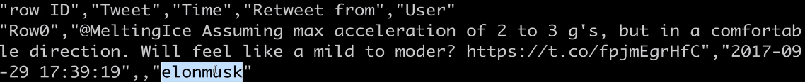

# Used Tools
- Apache Airflow
  - Apache Airflow is an open-source platform to Author, Schedule, and Monitor workflows.
- How were the tools setup?
  - Used an Ubuntu OS on VirtualBox for the dev environment
  - Installed airflow, celery, crypto, mysql, rabbitmq, redis
- Start airflow
  - airflow webserver (for webserver UI)

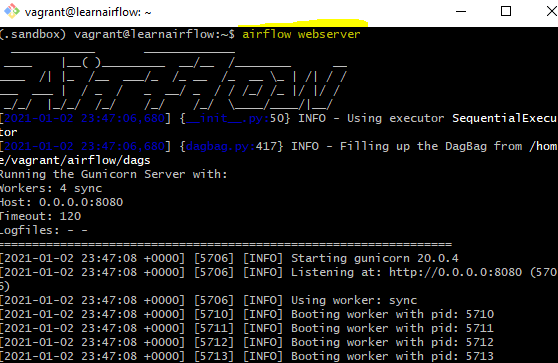

  - airflow scheduler (allows you to start scheduler and trigger your dags)

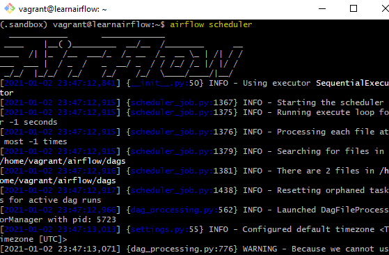

# Creating a DAG
- Created file 'twitter_dag.py' in folder /airflow/dags

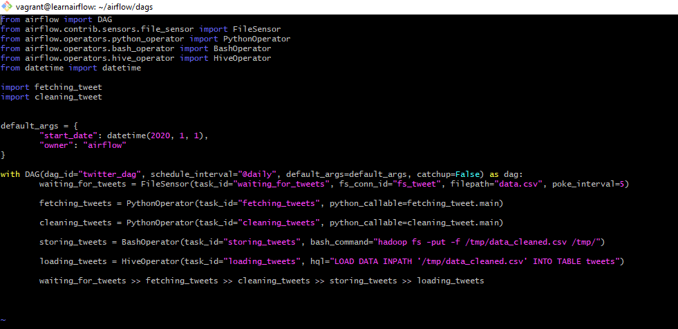

# Task 1
- waiting_for_tweets
  - At a given interval of time, this task is checking to see if the file containing the tweets is available
  - Added a connection for sensor operator, to check if a file is in a specified location
  - 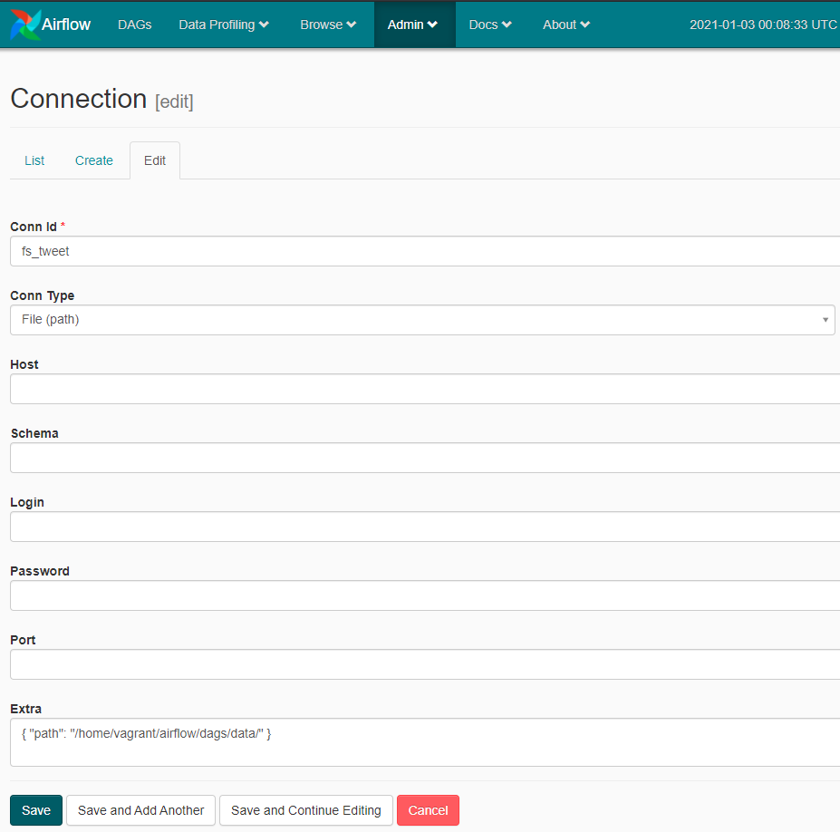
  - 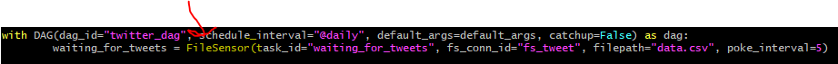

# Task 2
- fetching_tweets
  - fetch tweets from CSV file, format timestamp, drop null columns, export formatted data into 'data_fetched.csv'
  - this script extracts tweet
  - 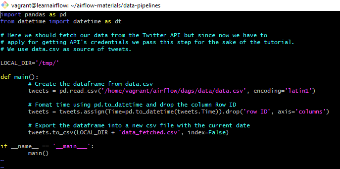

  - added PythonOperator to twitter_dag.py script
  - 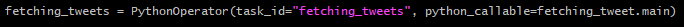

# Task 3
- cleaning_tweets
  - transforming and cleaning data to be loaded
  - new script: 'cleaning_tweet.py'
  - 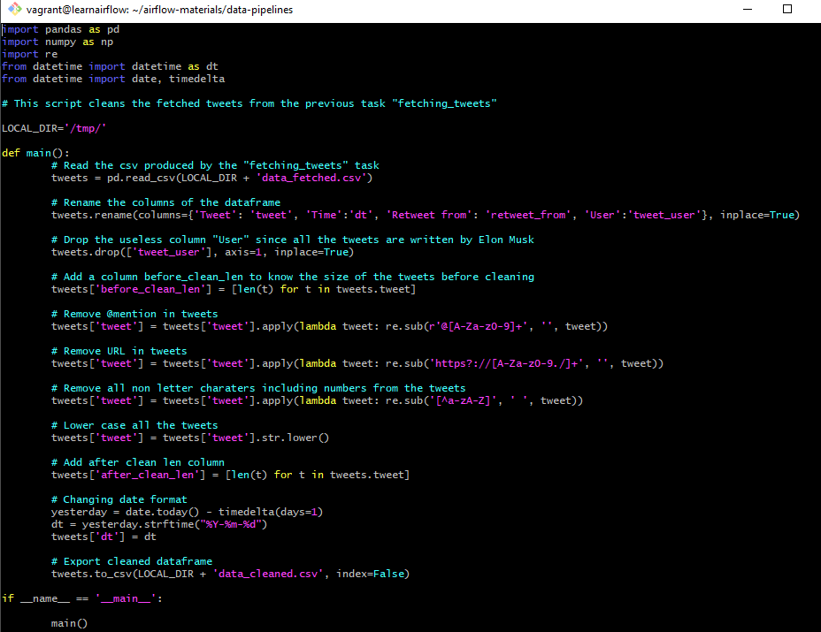

  - Added cleaning_tweets function to DAG script
  - 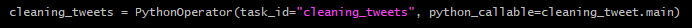

# Task 4
- storing_tweets
  - push the data into HDFS
  - add the function to the DAG script:
  - 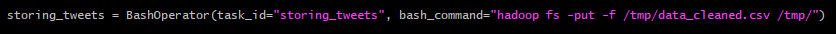

# Task 5
- loading_tweets
  - load tweets into Hive table
  - add the function to the DAG script:
  - 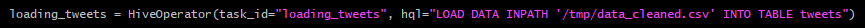

# Dependencies
- Organize our tasks in order
  - add the dependencies to the DAG script:
  - 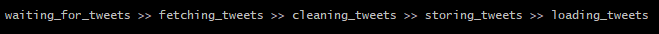
  - 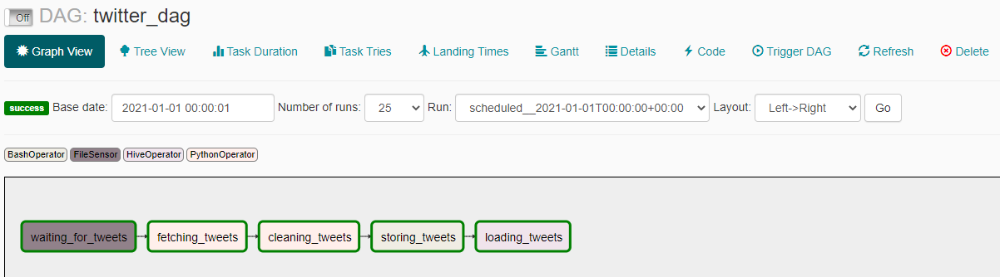

# Run DAG
- 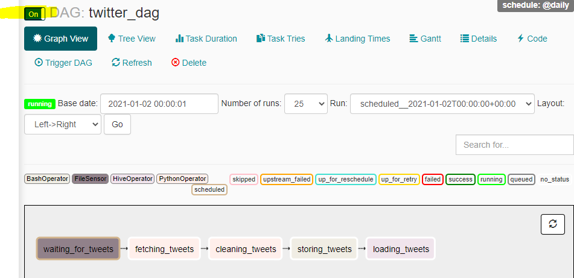
- Copy CSV file to dags folder and refresh UI
 - 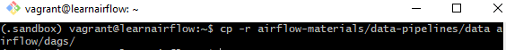
- Create Hive table
 - 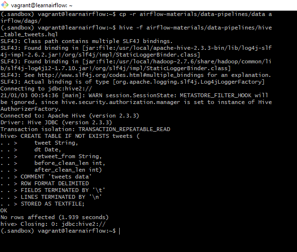
- Run Hive 'hive'
- Query table
  - 

- Success:
  - 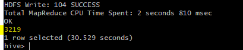

# Results
- The DAG successfully ran when the new CSV data file appeared in the desired folder. Normally the data would populate in the folder from the Twitter API, but for the purpose of the demo, I manually copied the CSV file into the folder

# Conclusion
- Apache Airflow is an excellent tool to create an automated pipeline to run Cron jobs at the desired interval of time. A DAG is a collection of tasks designed to run in order using various operators.

